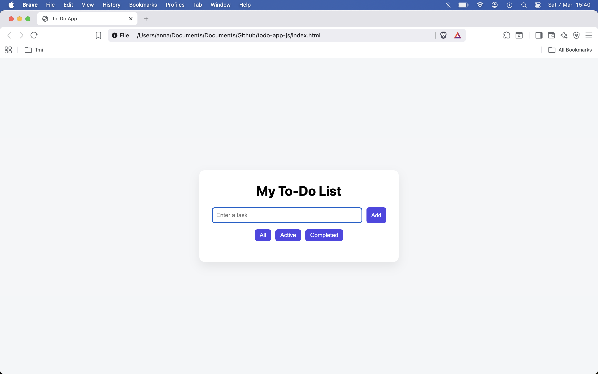

HEAD
# To-Do List App

A simple web-based To-Do List application built with **HTML, CSS, and JavaScript**.

## Features

- Add tasks
- Mark tasks as completed
- Delete tasks
- Filter tasks (All / Active / Completed)
- Tasks persist using localStorage
- Press Enter to add a task

## Technologies Used

- HTML
- CSS
- JavaScript (Vanilla)
- Browser localStorage

## How It Works

Tasks are stored in the browser using `localStorage`, allowing them to persist even after the page is refreshed.

## Future Improvements

- Drag and drop task ordering
- Dark mode
- Due dates for tasks
- Backend storage (database)

## Live Demo

[View the live app here] https://annago-tech.github.io/todo-app-js/  

## Author

Built as a learning project while studying JavaScript and Web3 development.

# todo-app-js
Simple web-based to-do list app built with HTML, CSS and JavaScript.
d7e33fe13bebcaeb5fe8b2035e1f620d5efccd5c
